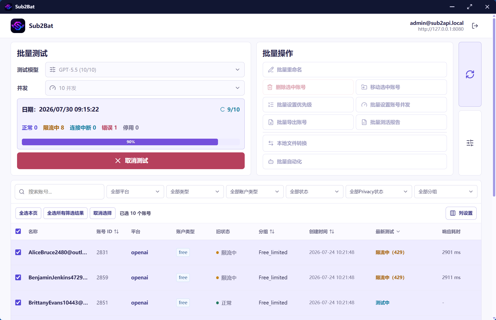
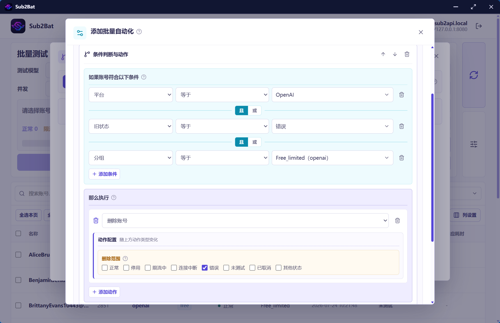
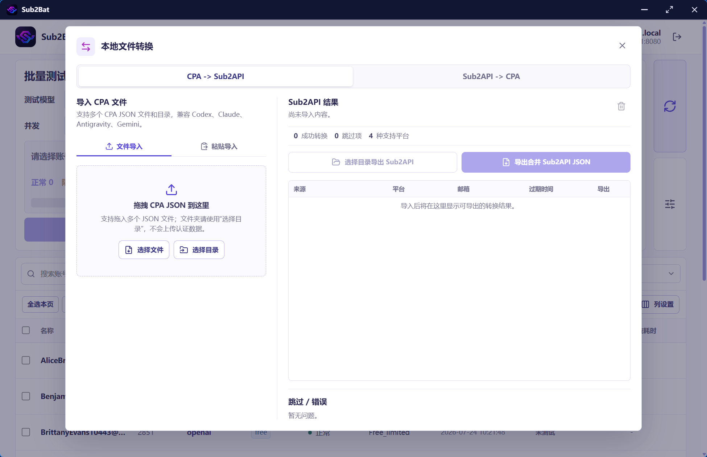

# Sub2Bat

一个可分享的 Windows 桌面工具：登录任意兼容的 sub2api 管理站点后，集中查看账号并批量测试连接。


## 项目介绍

Sub2API 管理端在测试账号活性时，需要逐个账号手动触发；当账号数量较多时，测试、筛选和后续处理会变得繁琐。Sub2Bat 在现有批量测试项目的基础上继续改进，把账号测活、批量维护、导出、格式转换、报告和自动化集中到一个 Windows 桌面工具中。

- **批量测活**：选择当前页、已选账号或全部筛选结果，按指定模型和并发数批量测试账号活性，并实时汇总状态与响应耗时。
- **批量维护**：补充 Sub2API 管理端缺少或需要逐项完成的操作，包括批量重命名、批量设置优先级、批量设置账号并发、移动和删除等。
- **批量导出**：可将账号导出为 Sub2API 备份格式或 CPA 格式，并在导出前核验账号范围，降低误导出风险。
- **本地格式转换**：支持 CPA 与 Sub2API 格式双向转换，文件解析、转换和打包均在本机完成，不会上传认证数据。
- **测活报告**：可导出测试报告，用于统计正常、限流、连接中断、错误、停用等账号状态及响应耗时。
- **自动化操作**：可按平台、分组和账号状态组合筛选条件，并依次执行多种操作；既支持单次执行，也支持按时间间隔自动重复。自动重复时会在上一轮完全结束后再开始等待间隔，避免任务重叠。

## 与 Sub2API 更新的关系

Sub2API 更新较快，直接修改 Sub2API 服务端源码来增加这些功能，后续升级时往往需要反复处理本地改动与上游更新之间的合并问题；但有些新版本的重要功能又使得升级不可避免。

Sub2Bat 将批量测活、批量维护、导出、转换、报告和自动化放在独立的客户端中实现，不改动 Sub2API 服务端源码。因此，升级 Sub2API 后通常不需要重新合并 Sub2Bat 的源码改动，理论上只要稳定的管理 API 仍保持兼容，Sub2Bat 就可以继续使用。若上游移除接口、改变接口语义或引入破坏性 API 更新，则仍需要同步适配 Sub2Bat。

## 来源与维护

Sub2Bat 是基于 [ljh-696/sub2api-batch-tester](https://github.com/ljh-696/sub2api-batch-tester) `v1.1.0` 开发的独立衍生版本，由 H.X. 修改和维护。

原项目 Copyright (c) 2026 Picard-ljh，并依据 MIT License 开源。Sub2Bat 主要增加和完善了账号筛选、批量操作、自动执行、导出、窗口交互及安全性增强等功能。

本地 CPA/Sub2API 双向转换功能参考了 [gtxx3600/CPA2sub2API](https://github.com/gtxx3600/CPA2sub2API) 的公开实现与转换约定。该项目 Copyright (c) 2026 Hanhaofu，并依据 MIT License 开源，完整声明见 [THIRD_PARTY_NOTICES.md](THIRD_PARTY_NOTICES.md)。

本项目不是 Sub2API 官方产品，也不代表相关原项目维护者对本项目提供背书。版权与许可详情见 [LICENSE](LICENSE)、[NOTICE.md](NOTICE.md) 和 [THIRD_PARTY_NOTICES.md](THIRD_PARTY_NOTICES.md)。

## 界面预览

### 账号管理与批量操作



### 批量自动化



### 本地文件转换



## 功能

- 输入自己的 sub2api 站点地址、管理员邮箱和密码即可使用，不内置任何站点或账号信息。
- 跨重启记住登录：普通偏好保存在应用设置中，刷新令牌保存在 Windows Credential Manager；不会保存明文密码。
- 每次打开都不预选测试模型，不会依赖某个可能已被服务器下线的内置模型；用户标记为常用的模型只用于在列表中识别，仍需手动选择。
- 测试模型和完整账号类型目录均按需读取：登录、刷新账号后不会自动遍历全部账号。打开相应的下拉框时，软件才按当前已选账号或有效筛选范围读取并去重展示。
- 单次测试模型目录最多覆盖 `1,000,000` 个账号；服务端模型元数据读取采用最多 `16` 路并发，不会发起连接测试或消耗模型额度。
- 可测试已选账号或当前筛选结果，默认 20 并发，可选 5、10、20、50 或 100 并发；100 并发仅适用于确认服务器和上游平台均能承受高负载的场景。
- 每个账号实时展示排队、测试中、可用、配额耗尽、失败、取消、耗时和错误摘要；正在执行的批量任务可取消。
- 自动执行每次启动都会使用新的调度代次；其本地执行状态以原子方式更新，遇到损坏状态会停止执行而不是冒险重复运行。
- 受保护的自动删除会在复核账号状态后使用 HTTP 强 `ETag` 和 `If-Match` 条件删除。服务器未提供可用的强 `ETag` 时，软件会拒绝该删除操作。
- 账号凭据导出会核验服务端返回范围：带账号 ID 的兼容响应按 ID 严格核验；新版 Sub2API 官方备份格式不携带 ID 时，软件会按已选账号的名称、平台、类型和官方跳过影子账号数量逐条核验。范围不符、未选择账号或重复记录都会停止导出。大型账号备份、CPA 包和测试报告在后台 Worker 中生成，减少界面阻塞。
- 同一台电脑上同一时间只允许一个 Sub2Bat 进程运行，避免多个窗口同时修改、移动、删除或测试同一批账号。
- 直接复用 sub2api 现有管理员 API，不改动 sub2api 服务端。

## 安装

[GitHub Releases](https://github.com/HengXLab/Sub2Bat/releases) 中的 `Sub2Bat_1.1.3_x64-setup.exe` 是 Windows x64 安装程序。

1. 运行安装程序，按提示完成当前用户安装。
2. 如果电脑没有 WebView2，安装程序会下载 Microsoft WebView2 引导程序，因此首次安装需要网络。
3. 启动 `Sub2Bat`。

安装程序未进行代码签名。Windows 可能显示 SmartScreen 提示；请仅使用可信来源获得的安装包，并在需要时通过“更多信息”确认运行。

## 使用

1. 输入 sub2api 根地址，例如 `https://your-sub2api.example`。远程站点必须使用 HTTPS；仅本机回环地址可使用 `http://127.0.0.1`。也可以粘贴带 `/api/v1` 的地址，软件会自动规范化。
2. 输入管理员邮箱和密码，保留“记住登录”勾选即可在下次启动时自动恢复会话。
3. 登录后使用搜索和状态筛选定位账号，勾选需要测试的账号，或直接测试当前筛选结果。
4. 打开测试模型下拉框，从服务端当前返回的模型中选择测试模型。每次启动均不会预选模型，即使此前标记过常用模型也需手动确认。模型目录只会在打开下拉框后按当前已选账号或有效筛选范围读取；未选择账号时，范围最多为 `1,000,000` 个账号，后台最多同时读取 `16` 个账号的模型元数据。模型旁的 `x/y` 表示该模型在已查询账号中出现的数量。
5. 点击“测试已选”或“测试筛选结果”。不同平台账号对同一模型的兼容性由 sub2api 决定，模型不支持会作为单账号失败显示，不会中断其他账号。

打开“账号类型”筛选下拉框时，软件会按需收集当前可用范围内的类型并去重显示；未识别的类型会以“未识别”显示并可用于筛选。该读取同样不会执行连接测试。

## 自动执行与数据安全

- 自动执行的下一轮会在上一轮完成后再按设定间隔等待，不会因为固定时刻重叠启动。停止后重新启动会创建新的调度代次，并从第 1 轮开始。
- 自动执行状态通过本地原子替换保存。若状态文件异常或损坏，软件会拒绝继续执行，避免把未知状态当作“未执行”。
- 包含删除动作的受保护自动化会在删除前重新读取账号状态，并使用服务器提供的强 `ETag` 通过 `If-Match` 执行条件删除。未提供强 `ETag` 的兼容服务器不能执行此类删除；请在服务器支持版本标识后再使用自动删除。
- 同一台电脑只能运行一个 Sub2Bat 实例。再次启动时请先关闭现有窗口，防止并发批量操作相互干扰。

## 导出安全

账号备份与 CPA 导出只接受可验证且属于所选范围的账号。兼容服务器返回账号 ID 时，软件会逐条严格校验 ID；当前官方备份格式为便于迁移而不返回数据库 ID，软件会将返回记录与本次选择时保存的名称、平台、账号类型快照一一比对，并核对记录数及官方跳过的影子账号数。任一校验不符都会终止导出，不会生成可能包含错误凭据的文件。大型账号备份、CPA 包和测试报告由后台 Worker 生成，窗口仍可响应取消和其他界面操作。

## 登录记忆

“记住登录”保存的是刷新令牌，而不是密码。应用启动时会用刷新令牌获取新的访问令牌；服务器暂时不可用时会保留登录信息，只有刷新令牌被服务器明确拒绝时才会要求重新输入密码。

启用 TOTP 的 sub2api 管理员账号会在密码登录后显示 6 位动态验证码输入框。

## 兼容性边界

软件调用 sub2api 稳定的 `/api/v1` 管理接口，不依赖某一个固定版本号。对于新增响应字段、缺少部分分页元数据、缺失模型显示名或新增非终态 SSE 记录等非破坏性更新，软件会继续按兼容逻辑处理。若服务端移除了登录、账号、模型或连接测试接口，或改变了它们的语义，则属于破坏性更新，需要同步更新软件。

## 从源码构建

环境：Windows 10/11 x64、Node.js 24+、Rust stable、Visual Studio Build Tools（C++ x64）、WebView2 Runtime。

```powershell
npm install
npm run verify
npm run build
npm run build:installer
```

安装程序输出路径：

```text
src-tauri/target/release/bundle/nsis/Sub2Bat_1.1.3_x64-setup.exe
```

### 打包与本地数据

`npm run build:installer` 只打包应用二进制、前端资源和声明的安装资源，不会收集构建电脑中已经存在的登录会话、Windows Credential Manager 刷新令牌、应用设置、自动化状态、导出文件或缓存。上述用户数据只会在安装后的目标电脑上于运行时写入其本地用户目录。

## 项目结构

- `src/`: Vue 界面、状态组合函数和前端单元测试。
- `src-tauri/src/`: Rust 会话、Windows Credential Manager、sub2api API 客户端、SSE 解析和批量队列。
- `src-tauri/tests/`: Rust 单元测试。
- `docs/superpowers/`: 设计和实施记录。

## 已验证内容

- 前端：Vitest、TypeScript 检查和 Vite 生产构建。
- Rust：URL 规范化、登录/TOTP/刷新响应解析、分页 DTO、模型聚合、SSE 终态、批量状态与取消逻辑。
- 打包：Tauri release 可执行文件和 NSIS x64 安装程序。

## 作者

- H.X.：Sub2Bat 的修改与维护。

## 许可证

本项目依据 MIT License 开源。分发源码或安装包时须保留原项目的版权声明和许可文本，详见 [LICENSE](LICENSE) 与 [NOTICE.md](NOTICE.md)。
